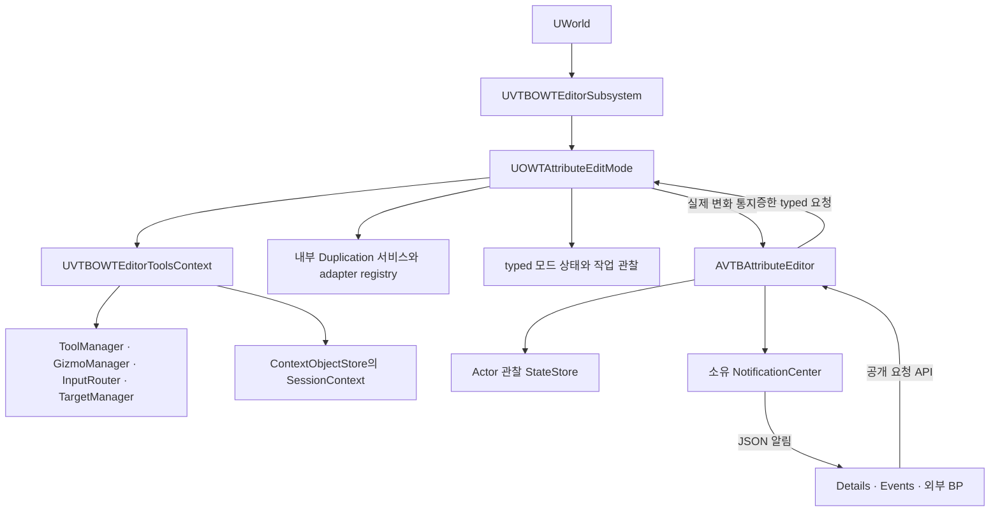

# Runtime AttributeEditMode와 PCG 계층 복제 설계 명세

작성일: 2026-10-07 · 대상: `simple_proj`, Unreal Engine 5.7 · v3 구현·검증 완료: 2026-10-08

Runtime 편집을 ITF의 ToolBuilder 등록, ToolManager 실행, Context 서비스 제공, 명시적인 도구 종료 구조로 전환한다. `UModelingToolsEditorMode`의 책임 분리를 적용하고, Duplicate를 편집 Runtime 모듈의 내부 기능으로 통합한다. PCGComponent를 가진 Actor와 그 계층은 작성된 설정을 독립 복제한 뒤 대상 월드에서 생성 결과를 재구성한다.

아래는 구현의 기준이 된 설계 계약이다. 실제 구현·검증 결과와 지원 경계는 [요구사항의 v3 기록](RuntimeAttributeEditor_Requirements.md), 설치·확장 API는 [사용법](RuntimeAttributeEditor_Usage.md)에 기록했다. 설계의 각 문장을 모든 임의 BP·native 구성에 대한 무조건적인 지원 보장으로 해석하지 않는다.

## 1 설계 결정과 범위

| 항목 | 적용할 결정 |
|---|---|
| AttributeEditMode | 여러 ITF Tool을 관리하는 Runtime 모드 호스트. `UInteractiveTool` 하나와 구분한다 |
| Modeling 모드 참조 방식 | 등록, Context 서비스, 시작·종료, 확장 제공자 구조를 적용한다. Editor 전용 모드를 상속하지 않는다 |
| Runtime 모듈 | 기존 `VTBOWTEditor` 이름을 유지한다. 현재 descriptor에서도 Runtime이며 기존 BP script 경로를 보존한다 |
| Duplicate 통합 | 독립 `OWTRuntimeDuplication` 모듈을 제거하고 구현·인터페이스를 `VTBOWTEditor/Duplication`으로 이관한다 |
| PCG 의존성 | 이번 구성은 PCG를 사용하는 편집 플러그인이다. PCG Runtime 모듈을 private 의존성으로 선언하고 PCG plugin을 활성화한다 |
| 확장 방식 | Tool, TargetFactory, Context 서비스, 복제 adapter를 등록 계약으로 추가한다 |
| 상태와 이벤트 | Actor 관찰 상태, 모드·작업 상태, JSON 전송을 분리한다. AttributeEditor가 Pub-Sub 소유권을 유지한다 |
| 기본 계층 복제 | 선택 루트, 작성된 attachment 후손, ChildActorComponent 관리 계층을 포함한다. PCG가 생성한 객체는 별도로 분류한다 |
| PCG 복제 의미 | graph·parameter overrides·seed·설정을 독립 복제하고 새 위치에서 재생성한다 |
| 완료 의미 | 작성된 Actor 계층의 복제 완료와 PCG 생성 결과 준비 완료를 구분한다 |
| 실행 환경 | 기존 standalone 편집 범위를 유지한다. 네트워크 권한·복제 정책은 별도 설계 대상이다 |

일반 BP 변수·컴포넌트·instanced UObject·ChildActor 내부 참조·이름 증가·지원 MID 및 물리 설정 보존은 기존 회귀 요구사항이다. 임의 native 리소스, custom PCG 실행 상태, 진행 중인 Blueprint 실행, 타이머와 delegate를 메모리 snapshot처럼 복제하지 않는다.

PCG 결과는 위치, landscape, spline, 외부 Actor 조회와 generation source에 따라 달라질 수 있다. 동일 graph와 seed는 동일한 입력 설정을 의미하며, 이동된 위치에서 원본 생성물과 비트 단위로 동일한 결과를 보장하지 않는다. 생성 결과를 고정 복사하는 기능은 기본 계약에 포함하지 않는다.

## 2 현재 구조와 전환 지점

| 현재 구성 | 확인한 동작 | 전환 내용 |
|---|---|---|
| `UVTBOWTEditorSubsystem` | 모드 객체, 선택, ToolsContext, Gizmo와 tick을 직접 관리 | World·viewport·입력의 호스트가 되고 도구 수명은 Mode에 위임 |
| `UVTBOWTObjectEditMode` | `FInstancedStruct` context를 반사 기반 handler로 전달 | 기존 BP 입력 계약을 보존하는 호환 클래스 |
| `UVTBOWTEditorToolsContext` | Runtime Queries/Transactions, snapping context 제공 | 선택·실행 서비스 조회, 선택 변경, render bridge 연결 확장 |
| ToolManager | Tick은 있으나 편집 ToolBuilder 등록·활성 Tool 흐름 없음 | 실제 AttributeEditTool/DuplicateTool 등록과 실행 |
| `AVTBAttributeEditor` | JSON 검증, Actor 관찰, TRS 적용, 복제 직접 호출 | 기존 외부 API를 유지하고 실행 요청은 Mode와 Tool에 전달 |
| `UOWTAttributeStateStore` | Actor 관찰 snapshot과 baseline 보관 | 현재 책임 유지. 도구 진행률이나 JSON 요청을 Actor 상태로 저장하지 않음 |
| `UOWTRuntimeActorDuplicator` | 동기 구성 복제, ChildActor 계층 지원 | 내부 서비스 이관, 작성된 attachment 계층과 사전 adapter 단계 추가 |
| 복제 Participant | generic preflight 이후 native 설정 복원 | 유지하되 PCG preflight adapter와 역할 분리 |
| Runtime Undo/Redo | transaction 함수와 Undo/Redo가 골격 | 이번 구조 변경만으로 Undo 지원으로 표시하지 않음 |

현재 복제기는 PCG의 `GraphInstance → ParametersOverrides → FInstancedPropertyBag`를 순회하며 지원하지 않는 구조체로 거부한다. 해당 금지 조건만 해제하면 PCG 생성물과 관리 리소스까지 복사할 수 있다. 따라서 adapter는 generic 캡처가 시작되기 전에 자신이 처리할 객체와 상태 범위를 결정해야 한다.

현재 계층 탐색에는 일반 `AttachToActor` 후손이 포함되지 않는다. PCGComponent 허용과 별개로 계층 범위를 확장해야 한다.

## 3 Modeling 모드에서 적용할 구조

| Modeling 모드의 역할 | Runtime 구성 |
|---|---|
| Enter와 Exit | `UOWTAttributeEditMode::Enter/Exit` |
| InteractiveToolsContext | 기존 `UVTBOWTEditorToolsContext` 확장 |
| 도구 등록과 실행 | `UInteractiveToolBuilder`, `UInteractiveToolManager` |
| 선택과 도구 대상 | 선택 Context, `UToolTargetManager`, Runtime TargetFactory |
| ContextObjectStore의 공용 서비스 | `UOWTAttributeEditSessionContext` |
| 외부 Tool extension | Runtime 전용 `IOWTAttributeModeExtension` |
| Toolkit의 도구 목록·속성 UI | registry 기반 Runtime 도구 목록과 기존 Details/Events 패널 |
| 도구 render와 HUD | Runtime viewport bridge |
| transaction 연계 | Runtime transactions adapter와 명시적인 history capability |

`UModelingToolsEditorMode`는 `UBaseLegacyWidgetEdMode`를 상속한다. 그 클래스나 Editor Toolkit을 Runtime으로 가져오지 않는다. Runtime 모듈에서 `UnrealEd`, `EditorInteractiveToolsFramework`, `ModelingToolsEditorMode`, `ModelingComponentsEditorOnly`, `PCGEditor`, `GEditor`를 사용하지 않는다.

ITF의 ToolManager·InputRouter·GizmoManager를 사용하는 것과 Modeling 모드의 모든 Tool을 Runtime에서 실행할 수 있다는 것은 다르다. 추가 Tool은 자신의 Runtime 의존성, TargetFactory, render, change/history 요구사항을 등록할 때 선언한다.

## 4 모듈과 파일 구성

```text
Plugins/OWTRuntimeEditing/
  OWTRuntimeEditing.uplugin
  Config/DefaultOWTRuntimeEditing.ini
  Content/Materials/
  Source/
    OWTEventCore/                     기존 owner-scoped JSON bus 유지
    VTBOWTEditor/                     Runtime 모듈 이름 유지
      Public/
        Modes/OWTAttributeEditMode.h
        Modes/VTBOWTObjectEditMode.h   기존 BP 호환 클래스
        Context/OWTAttributeEditSessionContext.h
        Context/VTBOWTEditorToolsContext.h
        Tools/OWTAttributeEditTool.h
        Tools/OWTAttributeEditToolBuilder.h
        Tools/OWTDuplicateTool.h
        Tools/OWTDuplicateToolBuilder.h
        Extensions/OWTAttributeModeExtension.h
        Extensions/OWTToolDescriptor.h
        Duplication/OWTRuntimeActorDuplicator.h
        Duplication/OWTRuntimeDuplicationParticipant.h
        Duplication/OWTDuplicationAdapter.h
        Duplication/OWTDuplicationRequest.h
        State/OWTAttributeStateStore.h
        State/OWTModeSnapshot.h
        State/OWTDuplicationOperationSnapshot.h
      Private/
        Modes/
        Tools/
        Extensions/
        Context/
        Rendering/OWTRuntimeToolsViewportBridge.*
        Duplication/                   기존 복제 구현 이관
          Adapters/OWTPCGDuplicationAdapter.*
          OWTDuplicationPlan.*
          OWTDuplicationAdapterRegistry.*
        State/
        UI/
        Tests/
```

위 신규 파일명은 구현 기준 이름이다. 유사 기능이 기존 파일에 있으면 중복 구현 대신 이관한다. Blueprint에 노출할 필요가 없는 plan·adapter 구현·PCG 세부 상태는 Private에 둔다.

`VTBOWTEditor.Build.cs`의 `OWTRuntimeDuplication` 의존성을 제거하고 `PCG`를 private 의존성으로 추가한다. Public 헤더에는 PCG 구현 타입을 노출하지 않는다. 같은 모듈의 private adapter만 PCG 헤더를 포함하며 generic 복제 core는 등록된 adapter 계약만 사용한다.

플러그인 descriptor에는 `OWTEventCore`, `VTBOWTEditor` 두 Runtime 모듈을 남긴다. plugin 의존성은 EnhancedInput과 PCG다. 이 구성에서 PCG 설치 없이 빌드할 수 있다고 안내하지 않는다. 향후 PCG 없는 배포판이 필요하면 PCG adapter를 선택 가능한 별도 integration plugin으로 추출할 수 있다.

## 5 소유권과 상태 원본



Subsystem이 Mode를 강하게 보관한다. Mode의 Outer는 Subsystem으로 유지해 기존 `GetTypedOuter<UVTBOWTEditorSubsystem>()` 기반 BP/C++ 경로의 이관 범위를 줄인다. Mode는 ToolsContext, 세션 서비스, 복제 서비스와 작업 상태를 `UPROPERTY`로 보관한다. `GetWorld()`는 자신의 소유 World를 반환한다.

AttributeEditor는 Notifications와 Actor StateStore를 계속 소유한다. Mode와 AttributeEditor의 역참조는 weak 참조로 두고 World·소유자 일치를 검사한다. ContextObjectStore에는 전역 singleton이 아닌 해당 세션의 서비스 접근 객체를 등록한다. 전역 extension 목록에 World별 mutable UObject를 저장하지 않는다.

선택 원본은 Mode의 선택 Context 하나로 정한다. 기존 Subsystem의 선택 API는 이 Context로 전달하고, 기존 선택 필드를 남겨야 한다면 읽기 호환용 값으로만 갱신한다. 두 객체가 각각 선택을 변경하는 구조를 만들지 않는다.

Actor Transform의 원본은 실제 Actor다. AttributeEditor가 typed 변화 통지를 받으면 Actor를 재관찰해 StateStore를 갱신하고 JSON 결과를 발행한다. Mode 내부의 실행 통신에 JSON을 사용하지 않는다. `UInteractiveToolPropertySet`은 UI 편집 모델이며 실제 상태 저장소가 아니다.

`hasChanges`는 기존 TRS baseline 비교와 새 복제본 표시를 유지한다. PCG graph나 모든 BP 속성의 저장 여부를 뜻하도록 의미를 바꾸지 않는다.

## 6 Mode와 Tool 생명주기

### 세션 수명

`Initialize → Enter/Exit 반복 → Shutdown`을 구분한다. Initialize/Shutdown은 World 편집 세션 수명이고 Enter/Exit는 F2 편집 활성 수명이다. Mode OFF에서도 AttributeEditor의 상태 조회와 F3 모니터는 살아 있다.

Initialize에서 세션 ID, adapter registry, 복제 서비스, committed 객체의 생성 상태 관찰을 준비한다. Enter에서 ToolsContext와 도구 연결을 구성한다. Exit는 편집 상호작용을 종료하며, 이미 확정된 복제 Actor를 삭제하거나 정상 PCG runtime scheduler를 중단하지 않는다. Shutdown은 새 요청을 막고 모든 세션 delegate·작업 참조를 정리한다.

### Enter 순서

1. World, 소유자, Editor 연결과 재진입 여부를 검사한다.
2. Queries/Transactions 객체를 생성하고 ToolsContext를 초기화한다.
3. SessionContext, 선택 서비스, snapping 등 필요한 Context 객체를 등록한다.
4. extension descriptor를 수집하고 TargetFactory, GizmoBuilder, ToolBuilder를 등록한다.
5. ToolManager lifecycle delegate와 Runtime viewport bridge를 연결한다.
6. 입력을 활성화하고 기본 AttributeEditTool을 시작한다.
7. 실제 활성 Tool과 모드 상태를 관찰한 뒤 알린다.

### Exit 순서

1. 새 편집 요청을 차단한다. 진행 중 수치 편집은 기존 Commit/Cancel 정책으로 정리한다.
2. InputRouter capture와 UI drag를 종료한다.
3. 활성 Tool을 종료한다. commit 전 복제 작업은 취소하고 생성한 대상만 정리한다.
4. Tool 소유 Gizmo와 interaction을 해제한다.
5. delegate, ToolBuilder, TargetFactory, ContextObject 등록 token을 해제한다.
6. ToolsContext를 Shutdown한 뒤 Queries/Transactions 객체를 파괴한다.
7. Actor와 모드 상태를 다시 읽고 편집 OFF를 알린다.

commit된 PCG Actor의 생성·cleanup은 PCG 시스템이 계속 관리한다. OFF 모니터에 필요한 관찰은 세션 수명으로 유지한다. Actor/Component 파괴, World 종료 시 해당 구독을 해제한다.

### 도구 공통 규칙

Builder의 `CanBuildTool`은 선택·대상·서비스 가용성을 검사하며 Actor 생성, 선택 변경, 생성 작업 예약을 하지 않는다. `BuildTool`은 Tool과 설정을 생성한다. `Setup`은 Context 및 PropertySet을 연결한다.

실제 작업은 Tool이 활성화된 뒤 실행한다. Duplicate 같은 즉시 작업도 `Setup()` 안에서 복제 후 종료하지 않는다. 첫 `OnTick` 또는 활성화 이후 명시 실행 단계에서 처리하고, 성공은 `Complete`, 미확정 작업 취소·실패는 `Cancel`로 종료한다.

UE5.7의 `UInteractiveToolsContext::StartTool` 반환만으로 성공을 확정하지 않는다. ToolManager의 선택·활성화 결과와 `OnToolStarted`, 실제 active tool을 함께 확인한다. `BuildTool == nullptr`, Setup 취소, 소유자 파괴도 정상적인 실패 경로다.

ToolManager는 DuplicateTool 종료 후 기본 도구를 자동 복원하지 않는다. 완료·실패·취소·활성화 실패 후 Mode가 Entered이고 활성 Tool이 없으면 다음 Mode tick에 registry의 `DefaultToolId`를 다시 활성화한다. 종료 delegate 안에서 곧바로 다른 Tool을 시작하지 않는다. 복제 성공 후 새 선택은 유지한다. Exit·모드 교체·provider 해제 중에는 복귀를 예약하지 않고, 기본 provider가 없으면 실행 불가 사유를 표시한다.

## 7 Tool 등록과 하드코딩 방지

Runtime 전용 `IOWTAttributeModeExtension`은 descriptor와 factory를 제공한다. 엔진의 Editor 전용 `IModelingModeToolExtension`을 Runtime 의존성으로 가져오지 않는다. native provider는 `IModularFeatures` 같은 등록 지점을 사용할 수 있으나 생성 객체는 매 세션의 소유자 아래에 둔다.

| 등록 정보 | 계약 |
|---|---|
| ToolId | 안정적인 식별자. 기본 ID도 한 곳에서 정의해 UI·입력·JSON이 공유 |
| 표시 정보 | 이름, 카테고리, 아이콘, 도움말, 정렬 순서 |
| Builder | `UInteractiveToolBuilder` class 또는 세션별 factory |
| PropertySet | Tool이 제공하는 속성과 Runtime UI presenter |
| capability | 선택 필요 여부, 수정 가능 대상, render/history 요구 등 |
| 등록 소유자 | provider ID와 해제 token |

기본 AttributeEdit와 Duplicate도 같은 등록 경로를 사용한다. 새 Tool 추가를 위해 Mode의 `switch`, 고정된 UI 버튼 배열, 입력 함수의 Actor 클래스 분기를 수정하지 않는다. UI는 registry를 조회하고 Builder의 실제 실행 가능 조건으로 버튼 상태를 갱신한다.

동일 ToolId 중복 등록은 오류로 거부한다. provider 해제 전 활성 Tool과 commit 전 작업을 종료하고 등록한 Builder·TargetFactory·Context 객체만 제거한다. unload 중 콜백이 provider 코드를 호출하지 않도록 세션 token을 무효화한다.

registry 등록 해제와 실제 provider 모듈 unload는 구분한다. commit 이후의 관찰, adapter, UObject, delegate가 provider 코드에 의존하면 unload를 지연하거나 거부한다. provider 독립적인 core 관찰 객체로 완전히 인계하거나 해당 관찰을 해제하고 객체 수명까지 정리한 뒤 unload를 허용한다. 이 정리를 위해 committed Actor를 삭제하거나 정상 PCG scheduler를 중단하지 않는다.

복제 adapter는 `UClass`·`UScriptStruct`·명시적 interface로 등록한다. Actor 이름, BP asset 경로, 컴포넌트 인스턴스 이름, `PCG_` 접두사로 동작을 결정하지 않는다. 타입별 처리는 typed adapter 내부에 둔다. 속성 범위를 지정할 때도 해당 타입 API 또는 검증 가능한 member 식별자를 사용한다.

상속된 타입은 더 구체적인 adapter를 우선한다. 같은 타입·우선순위의 충돌은 등록 오류다. UObject별 주 adapter 하나와 조합 가능한 보조 정책을 구분해 같은 상태가 두 번 복원되지 않게 한다.

기존 generic 안전 검사에 남아 있는 구조체 이름 문자열 비교도 실제 타입 metadata 또는 등록된 정책으로 치환한다. 복제 offset, hierarchy 범위, 생성 정책은 요청과 편집 설정에서 가져오며 구현 내부의 고정 수치로 덮어쓰지 않는다.

## 8 AttributeEditTool과 Runtime 입력 및 렌더링

`UOWTAttributeEditTool`은 기본 도구로 선택 interaction, TransformProxy, 선택 Gizmo 및 TRS PropertySet을 연결한다. 선택이 없을 때도 선택 입력을 받을 수 있고, 대상의 capability에 따라 Gizmo와 수치 입력을 활성화한다. rootless Actor의 복제 가능 여부와 Transform 수정 가능 여부는 별도 검사한다.

키보드 context, Details 필드, 외부 BP/JSON은 AttributeEditor의 검증을 거쳐 같은 typed 명령 실행 경로에 들어간다. 기존 Mode handler는 명령 변환만 하고 실제 Actor 값을 직접 바꾸지 않는다. Tool과 AttributeEditor가 서로 요청 API를 되호출하는 순환을 만들지 않는다.

Gizmo와 수치 편집은 같은 operation ID와 Begin/Update/Commit/Cancel 계약을 사용한다. active operation 중 다른 변경·복제는 Busy로 거부한다. 선택 revision이 달라지거나 대상이 파괴되면 오래된 요청을 적용하지 않는다. 외부 Actor 변경은 실제 값 재관찰 후 Proxy와 PropertySet에 반영한다.

Subsystem/Controller/Spectator는 입력을 Runtime bridge에 전달한다. UI hover/focus/drag 중 월드 선택, Tool capture, 카메라 입력을 차단하고 F2/F3 처리는 유지한다. Enhanced Input과 Tool의 capture가 같은 click을 중복 실행하지 않게 한다.

현재 프로젝트에는 일반 Tool용 `Render/DrawHUD` bridge가 없다. Runtime viewport/HUD의 실제 render pass에서 `IToolsContextRenderAPI`를 제공하고 ToolManager/GizmoManager의 렌더 경로를 연결한다. 게임 viewport 대신 Editor viewport API를 가져오지 않는다. 카메라 상태, screen ray, viewport 크기, 입력과 렌더의 World가 일치해야 한다. 기본 Actor 기반 Gizmo 표시만으로 일반 Tool 렌더 지원을 검증했다고 처리하지 않는다.

Transactions adapter의 `RequestSelectionChange`는 선택 Context로 전달해 성공 여부를 반환한다. Begin/End/AppendChange는 history capability를 명시한다. 이번 필수 범위는 편집 단계와 Cancel 복원이며 완전한 Undo/Redo stack은 별도다. history가 필요한 확장 Tool은 history provider가 없으면 실행 불가 사유를 표시한다. UI의 Undo/Redo도 실제 지원 전에는 비활성화한다.

## 9 Duplicate 내부 서비스와 계층 계획

`UOWTDuplicateTool`은 입력 자격과 작업 수명을 관리하고, 복제 알고리즘은 내부 `UOWTRuntimeActorDuplicator` 및 plan/adapter가 처리한다. UI나 Tool에 PCG별 필드 복사 코드를 두지 않는다. 기존 Participant는 그래프 재매핑 후 custom native 설정을 복원하는 최종 확장점으로 유지한다.

### 복제 범위

| 객체 관계 | 기본 처리 |
|---|---|
| 선택 root Actor | 포함 |
| ChildActorComponent 관리 Actor | 재귀 포함. managed child만 단독 복제하지 않음 |
| 일반 attachment 후손 | 기본 `AuthoredHierarchy` 범위에서 포함 |
| 외부 attachment parent | root를 분리하고 World Transform 보존 |
| authored component와 instanced UObject | 기존 지원 계약으로 포함 |
| Actor Owner/Instigator, 임의 외부 참조 | 자동 계층 확장 근거로 사용하지 않음 |
| PCG managed Actor/component | 작성된 계층에서 제외하고 대상 PCG가 재생성 |
| PCG partition Actor와 local component | 직접 복제하지 않고 PCG subsystem이 관리 |

요청에 `HierarchyScope`를 둔다. 새 UI와 Tool의 기본은 `AuthoredHierarchy`이며 `ActorAndManagedChildren`은 기존 범위 호환 옵션이다. 선택된 PCG 관리 생성물 자체는 authored source로 묵시 변환하지 않고 관리 객체라는 사유를 반환한다.

operation 전체에서 Actor/UObject map을 공유한다. attachment, ChildActor와 PCG ownership 경로의 중복을 제거하고 cycle을 검사한다. 내부 참조는 복제 map으로 치환하고 외부 asset·Actor 참조는 공유한다. 같은 World/Level 범위를 벗어난 후손은 부분 복제하지 않고 사전 검사에서 사유를 반환한다.

제외된 원본 PCG 생성물을 authored 속성·parameter가 참조하거나 authored child가 generated component에 붙어 있으면 일반 외부 참조 공유 규칙을 적용하지 않는다. 재생성 후 대응 객체를 식별하고 다시 연결하는 전용 adapter가 없으면 property/attachment 경로를 포함해 preflight에서 거절한다. 원본 생성물에 복제본의 의존성을 조용히 남기지 않는다.

root WorldOffset은 계층 전체에 한 번 적용한다. 자식 relative transform과 socket attachment를 보존하며 자식마다 offset을 중복 가산하지 않는다. 이름은 기존 family `_숫자` 증가 규칙과 Level 충돌 검사를 유지한다. 모든 생성 대상 이름을 먼저 예약하고, 재복제·삭제 후 재복제에서도 서비스의 증가 이력이 역행하지 않게 한다.

### 실행 순서

1. 선택, World, Actor 수명, 편집 권한, 원본 작업 상태를 검증한다.
2. adapter로 원본의 관리 객체를 먼저 분류하고 authored hierarchy plan을 만든다.
3. 전체 plan의 지원 여부·참조·이름을 검사한 뒤 설정을 캡처한다.
4. 대상 Actor를 deferred spawn하고 destination-only 자동 실행 억제를 적용한다.
5. 정상 Construction을 실행하고 component/instanced UObject/ChildActor를 구성한다.
6. 공통 object map으로 전체 참조를 재매핑하고 Transform·attachment·설정·Participant를 복원한다.
7. 전체 계층이 일관된 상태임을 검사한 뒤 authored state를 commit하고 새 root를 선택한다.
8. PCG 생성 관찰을 연결한 상태에서 trigger 정책에 맞춰 생성 또는 scheduler 등록을 재개한다.

계층 중 하나의 실패는 commit 전 전체 새 계층의 정리 대상이다. 생성된 객체의 raw pointer를 장기 보관하지 않고 weak 참조와 operation token으로 검사한다. 원본의 설정, 생성 task, resource ownership은 변경하지 않는다.

## 10 PCG adapter 계약

### generic 캡처보다 먼저 참여

`UPCGComponent`용 typed adapter는 PCG base 상태, 소유 GraphInstance와 parameter override 처리권을 가진다. generic 복제기가 그 내부를 다시 순회하지 않게 한다. PCG 파생 BP의 추가 authored UPROPERTY는 generic 안전 복사 또는 해당 타입의 추가 adapter가 담당한다. 파생 속성을 전부 누락하고 성공으로 처리하지 않는다.

예정된 adapter 단계는 다음과 같다. 이는 프로젝트용 계약이며 엔진의 기존 메서드 이름이 아니다.

```text
ValidateSource
  → ClassifyManagedObjects
  → CaptureConfiguration
  → PrepareDestination
  → RestoreConfiguration
  → RemapReferences
  → ObserveGeneration
  → ActivateAfterCommit
  → CancelAndCleanupDestination
```

### 복사와 재생성의 경계

| PCG 상태 | 처리 |
|---|---|
| 외부 graph asset/interface | 외부 asset 참조 공유 |
| component-owned GraphInstance | 대상에 독립 인스턴스 유지 |
| parameter overrides와 override flags | 엔진 API로 복사 후 내부 참조 재매핑 |
| Seed, InputType, 활성화 의도 | 보존 |
| GenerationTrigger, partition 설정, generation radii | 보존하고 대상의 실행 방식에 반영 |
| scheduling policy class와 인스턴스 설정 | 대상 소유 인스턴스로 복원 |
| 작성된 spline/shape/custom component | 일반 authored 구성으로 보존 |
| GeneratedResources와 generated ISM/HISM/Actor | 원본에서 복사하지 않음 |
| task ID, graph output/cache, generated flag, last bounds | 새 실행에서 계산 |
| original/local partition mapping | PCG subsystem이 새 대상으로 구성 |

`SetPropertiesFromOriginal`은 UE5.7의 설정 전송 근거로 활용한다. 이 함수가 모든 필드를 복사한다고 가정하지 않는다. 활성화·partition 설정과 파생 타입의 추가 상태는 별도 계약으로 확인한다. 소유 GraphInstance에는 `CopyParameterOverrides` 등 엔진 API를 사용한다.

GraphInterface와 parent chain도 실제 ownership으로 분류한다. 외부 asset은 공유할 수 있지만 원본 component 또는 그 계층이 소유한 중첩 GraphInstance는 새 대상에 독립 복원한다. API가 받는 타입이 GraphInterface라는 이유만으로 모두 외부 asset으로 취급하지 않는다.

parameter bag 안의 hard/soft object 참조, 배열, 구조체도 전체 object map 기준으로 재매핑한다. 미로드 외부 soft reference는 그대로 유지한다. 안전하게 순회할 수 없는 opaque 값은 property 경로와 실패 원인을 반환한다. 전체 `FInstancedPropertyBag` 금지를 일괄 해제하거나 raw memory로 복사하지 않는다.

managed output 분류는 `AreManagedResourcesAccessible`, `ForEachConstManagedResource`, `IsAnyObjectManagedByResource`, resource의 `IsManaging` 등 실제 소유권 API를 사용한다. 필요한 경우 같은 World의 PCG 관리 관계를 조회하되 PCG adapter 안에 제한하고 매 tick 전체 Actor를 스캔하지 않는다. custom managed resource가 소유 객체를 정확히 보고하지 못하면 전용 adapter가 필요하다. 이름이나 tag 추정으로 원본 생성물을 복제하지 않는다.

private `GeneratedResources`나 partition mapping을 reflection 문자열로 찾아 덮어쓰지 않는다. 복제본 cleanup이 원본 생성물을 삭제할 수 있는 공유 참조를 남기지 않는 것이 필수 불변 조건이다.

### 생성 재개 정책

PCG의 BeginPlay는 자동 생성과 subsystem 등록을 수행할 수 있다. 대상의 설정 일부만 복원된 상태에서 실행되지 않도록 대상만 비활성화한다. 전체 authored 계층의 참조·설정 복원과 commit이 끝난 뒤에만 활성화 의도를 되돌린다. 개별 component 복원 직후 활성화하지 않는다. 관찰 delegate는 활성화 전에 연결해 첫 started/completed 이벤트도 받는다. 원본을 잠시 비활성화하는 방식은 금지한다.

일반 Actor 계층은 각 Actor의 BeginPlay 시점이 다를 수 있으므로, 모든 대상 PCG에 대해 복원 전에 실행을 막는 사전 hook이 필요하다. BP Construction/BeginPlay가 직접 PCG 생성이나 외부 부수 효과를 강제로 실행하는 custom 클래스는 협력 인터페이스나 추가 adapter로 조율한다. 임의 BP 코드를 generic preflight가 분석해 이런 부수 효과를 자동 판별할 수 있다고 보장하지 않는다. custom 실행에는 명시적인 capability 선언과 검증된 lifecycle hook이 필요하며, 이 계약을 충족하지 못하는 구성은 지원 범위에서 제외한다.

| 원래 정책 | commit 이후 처리 |
|---|---|
| 비활성 PCG | 비활성 유지, 생성 요청 없음 |
| GenerateOnLoad | 이미 처리된 BeginPlay와 중복되지 않게 대상에서 한 번 생성 |
| GenerateOnDemand이며 원본이 미생성 | 기본적으로 미생성 유지 |
| GenerateOnDemand이며 원본이 생성됨 | 기본 `RegenerateIfSourceGenerated` 정책으로 대상 생성 요청 |
| GenerateAtRuntime | 대상 등록·refresh 후 runtime scheduler가 generation source/radii에 따라 처리 |

일반 on-demand 생성은 `GenerateLocalGetTaskId` 또는 해당 Runtime API를 사용한다. `GenerateAtRuntime`는 `UPCGSubsystem::RefreshRuntimeGenComponent`와 scheduler 경로를 사용하며 일반 `GenerateLocal(true)`로 우회하지 않는다. generation source가 없거나 범위 밖이면 정상 대기 상태다.

UE5.7의 `NotifyPropertiesChangedFromBlueprint` 구현은 Editor 조건부라 packaged runtime 재생성 근거로 사용할 수 없다. `Refresh`, `PostEditChangeProperty`, `PCGEditor` API에도 의존하지 않는다.

CPU graph의 non-partitioned, partitioned/hierarchical, Runtime generation을 필수 검증 범위로 둔다. 특정 grid 기능이 packaged 환경에서 충족되지 않으면 그 조합의 지원을 완료로 표시하지 않는다. GPU PCG 지원은 실제 RHI 검증이 필요한 별도 capability이며 NullRHI 테스트만으로 보장하지 않는다.

## 11 요청과 비동기 완료 계약

동기 bool 하나로 복제 완료와 PCG 결과 준비를 표현하지 않는다. 새 `BeginDuplicateOperation` API는 접수 결과와 operation ID를 반환하고 이후 typed snapshot과 이벤트로 상태를 조회한다.

```text
Duplicate operation
  Accepted → Planning → Restoring → Committed
                  └→ Failed / Cancelled / CleaningUp

Component generation observation
  NotRequested / Scheduled / WaitingForGenerationSource
    → Generating → Ready / Failed / Cancelled
    → Cleaned 또는 다음 generation attempt
```

`Committed`는 authored 계층과 PCG 설정의 독립 복제 완료다. DuplicateTool은 이 시점에 Complete할 수 있다. PCG scheduler가 향후 source를 기다리는 동안 도구를 계속 Busy로 두지 않는다. 생성 관찰은 Tool보다 긴 세션 수명으로 이동한다.

기존 `RequestDuplicate` BP 함수는 유지하되 새 API를 권장한다. v3에서는 bool을 **요청 접수 여부**로 정의하는 의미 변경을 명시하고, 완료를 bool로 판단하던 호출부를 `ObjectDuplicated` 또는 operation snapshot 기준으로 이관한다. 기존 소스 레벨 서비스 `DuplicateActor`는 authored 구성 복제 완료만 반환하는 호환 wrapper로 유지할 수 있으나 Mode/UI 실행 경로가 이를 우회 호출하지 않게 한다. PCG 생성 완료를 동기 반환으로 보장하지 않는다.

request ID는 중복 접수 방지에 사용하고 operation ID는 수명 추적에 사용한다. component ID와 generation attempt를 별도로 둔다. 오래된 callback이 새로운 복제나 재생성 상태를 덮어쓰지 못하도록 세션 token·operation·대상 weak 참조를 모두 확인한다.

### 상태와 이벤트

| typed 조회 | 포함할 정보 |
|---|---|
| 기존 Actor snapshot | 선택 ID, 실제 TRS, baseline, 편집 가능 여부 |
| Mode snapshot | mode ID, active tool ID, 도구 단계, 실행 capability와 사유 |
| Duplicate operation snapshot | request/operation ID, 원본·복제 root ID, 계층 범위, 단계, 오류 |
| PCG component snapshot | component ID, graph, trigger, 관찰 상태, generation attempt, 대기·실패 사유 |

`ObjectDuplicated`는 operation당 authored commit에 대해 한 번만 발행한다. 생성물이 아직 준비되지 않았다면 결과에 해당 상태를 명시한다. 생성 상태는 별도 `ProceduralGenerationChanged`로 알린다. root PCG component 하나의 완료를 전체 계층 완료로 간주하지 않는다. 생성물 0개도 정상 완료일 수 있다.

`ToolStarted/ToolEnded`, `DuplicateOperationChanged` 등 새 이벤트는 descriptor 계약으로 정의한다. 기존 schemaVersion 1 요청은 기존 필드와 기본 정책으로 해석하고 새 범위·생성 정책을 지정하는 요청은 version 2로 구분한다. 기존 이벤트 필드의 의미를 뒤집지 않고 확장 필드를 추가한다. bool 의미 변경과 schema 이관은 별도 호환성 항목으로 검증한다.

모니터는 상단 Mode/Tool/선택/작업 상태, operation별 Actor 구성 복제 상태, component별 PCG 상태를 표시한다. event JSON은 진단·전송용이며 화면의 현재 상태는 typed 조회로 갱신한다. 계산 근거가 없는 진행률 백분율 대신 현재 단계와 대기 사유를 표시한다.

## 12 실패와 취소

| 상황 | 처리 |
|---|---|
| source 또는 그 local partition component가 생성/cleanup 중이거나 resource 읽기 불가 | `SourceBusy`로 접수 거부. 원본 작업은 취소하지 않음 |
| graph/asset 미로드 또는 cooked 빌드에서 사용 불가 | 명시적 실패. 누락 상태로 성공하지 않음 |
| 지원하지 않는 custom parameter/resource | adapter·property 경로를 포함한 실패 |
| commit 전 Construction/복원 실패 | 새 계층과 새 대상의 PCG 자원만 정리 |
| commit 전 Mode Exit 또는 tool cancel | provisional operation 취소 및 정리 |
| commit 후 PCG 생성 실패 | authored 복제본은 유지하고 생성 실패를 표시. 자동으로 삭제하지 않음 |
| Actor/component 파괴 | 해당 관찰 해제, 오래된 callback 무시 |
| World 종료 | 새 작업 차단, callback 무효화, World teardown과 조율한 대상 정리 |

`CancelGeneration` 호출만으로 cleanup 완료를 선언하지 않는다. 먼저 대상 PCG를 비활성화하고 대상 scheduler의 새 generation·재예약을 차단한다. 이후 생성 작업 취소, 대상 resource/local partition 정리, 대상 Actor 제거 순서를 확인한다. 정리가 비동기이면 `CleaningUp` 상태를 유지하고 완료 후 terminal 결과를 발행한다. 정리 시간 초과 시 잔여 대상 ID와 원인을 남긴다.

`CleanupLocalImmediate(true, true)` 같은 Runtime API는 World 상태와 resource 접근 가능 시점을 확인해 사용한다. PCG Actor의 `Destroy`나 EndPlay만 호출했다고 원본과 대상의 모든 관리 자원이 정리됐다고 가정하지 않는다. 자동 삭제 범위는 해당 operation이 만든 대상과 그 대상이 소유한 생성물로 한정한다.

Construction/BeginPlay/사용자 hook이 외부 세계에 만든 임의 부수 효과까지 일반 rollback으로 되돌린다고 보장하지 않는다.

## 13 기존 코드와 자산 이관

1. `OWTRuntimeDuplication/Public|Private/Duplication`을 `VTBOWTEditor` 내부로 옮긴다. 클래스 이름과 `Duplication/...` include 경로를 유지하고 export macro를 `VTBOWTEDITOR_API`로 변경한다.
2. descriptor와 소비 모듈 Build.cs에서 독립 duplication 모듈 참조를 제거한다. `VTBOWTEditorAutomation`과 독립 소비 프로젝트도 변경한다.
3. 기존 `VTBOWTEditor → OWTRuntimeDuplication` duplicator redirect를 제거하고 아래 방향으로 교체한다. 양방향 redirect를 남기지 않는다.

```ini
+ClassRedirects=(OldName="/Script/OWTRuntimeDuplication.OWTRuntimeActorDuplicator",NewName="/Script/VTBOWTEditor.OWTRuntimeActorDuplicator")
+ClassRedirects=(OldName="/Script/OWTRuntimeDuplication.OWTRuntimeDuplicationParticipant",NewName="/Script/VTBOWTEditor.OWTRuntimeDuplicationParticipant")
```

4. restore component와 함수에 대한 실제 직렬화 참조도 점검한다. 필요한 경우 해당 class/function redirect를 추가한다. EventCore의 기존 redirect는 유지한다.
5. `UOWTAttributeEditMode`를 Runtime host로 도입한다. 기존 `UVTBOWTObjectEditMode`는 같은 script 이름의 호환 파생 클래스로 유지하고 기존 context UFUNCTION은 forwarding 계약을 보존한다. BP override·상속된 reflected 함수 이동은 실제 BP 로드/컴파일로 검증한다.
6. Subsystem은 configurable mode class를 생성하고 Enter/Exit를 호출한다. 구 `SetActiveEditMode(UObject*)` 경로도 기존 모드를 종료한 뒤 새 모드를 초기화하도록 연결하며 단순 포인터 교체로 남기지 않는다.
7. Actor facade의 직접 복제 실행, Subsystem의 Gizmo 생성, Mode의 직접 TRS 변경을 각각 담당 Tool/서비스 경로로 옮긴다. 한 기능에 두 실행 경로를 장기간 남기지 않는다.
8. 기존 요청/입력/UI 테스트를 ToolManager 경로로 변경한다. 직접 delegate 실행만으로 lifecycle 테스트를 대체하지 않는다.
9. 사용법, dependency 예시, 독립 소비 프로젝트와 배포 ZIP을 함께 갱신한다. 오래된 duplication DLL과 모듈 목록이 새 배포에 섞이지 않게 한다.

CoreRedirect는 C++ Build.cs 의존성을 고쳐주지 않는다. 외부 소비자가 `OWTRuntimeDuplication`을 사용했다면 `VTBOWTEditor`로 변경하고 재빌드해야 한다.

## 14 병렬 구현 분담과 순서

가용 동시 슬롯은 루트 포함 4개다. 필요한 하위 에이전트는 3개이며 **통합 1명 + 하위 3명**으로 구성한다.

| 담당 | 소유 범위 | 완료 산출물 |
|---|---|---|
| 통합 담당 | 공통 public 계약, facade, 모듈·descriptor·redirect, 통합 | 소유권·호환성 확정, 전체 빌드·packaged 검증 |
| ITF 담당 | Mode/Tool/Builder, Context, selection/input/render bridge | 등록·전환·종료, 기본 AttributeEdit/Duplicate Tool 연결 |
| 복제와 PCG 담당 | 내부 Duplication, plan, adapter registry, PCG adapter | 작성된 계층 복제, 독립 PCG 설정/생성/정리 |
| 상태와 검증 담당 | typed operation·monitor, fixture와 migration 검증, 문서 | 상태·이벤트 계약, 회귀 및 PCG 테스트 |

공통 헤더, Build.cs, descriptor, redirect는 통합 담당만 수정한다. ITF 담당의 DuplicateTool은 복제 담당의 확정된 서비스 계약을 호출한다. PCG 담당은 UI 파일을 변경하지 않고 typed 결과를 제공한다.

1. 공통 계약을 먼저 확정한다. Mode/session ownership, descriptor, duplicate request/result, adapter phase, operation snapshot을 합의한다.
2. ITF lifecycle, 계층/PCG 복제, 모니터/fixture를 병렬 구현한다.
3. native Actor의 새 Tool 경로를 먼저 연결하고 기존 복제 회귀를 통과시킨다.
4. PCG 설정 복원과 commit 이후 generation을 연결한다. source/destination resource 독립성을 우선 검증한다.
5. BP/CoreRedirect 이관, partition/runtime scheduler, 실패 정리를 검증한다.
6. Editor·Game target, cook/stage, 별도 소비 프로젝트 및 실제 RHI 실행을 검증한 뒤 배포한다.

현재 프로젝트의 Git 탐색 루트는 프로젝트 밖 사용자 폴더로 잡혀 있으므로 이를 대상으로 자동 worktree/commit을 만들지 않는다. 구현 시 의도한 저장소 경계가 확정되지 않았다면 현재 폴더에서 파일 소유권을 나눠 작업한다.

## 15 인수 테스트

| 영역 | 필수 시나리오와 합격 조건 |
|---|---|
| Runtime 의존성 | Editor/Game build에 Editor 전용 모듈 링크 없음, PCG Runtime dependency 명시 |
| 모드 수명 | Enter/Exit 반복, 도중 World 종료 후 Tool/Builder/delegate/Context/capture 누적 없음 |
| Tool 활성화 | CanBuild 거절, null BuildTool, Setup 취소가 시작 성공으로 발표되지 않음 |
| 기본 도구 복귀 | Duplicate 완료·실패·취소 뒤 다음 tick에 기본 도구 복귀, 새 선택 유지, Exit 중에는 재활성화 없음 |
| 확장성 | 별도 테스트 provider가 새 Tool·TargetFactory를 등록하는 것만으로 UI 노출·실행·해제 가능 |
| provider 수명 | committed 생성 관찰이 남아 있으면 unload 거부/지연, 관찰 인계·해제 이후 stale callback이나 vtable 접근 없음 |
| 입력과 렌더 | 실제 입력→InputRouter→Tool, 일반 Tool Render/DrawHUD 확인, UI 포커스 중 월드 입력 차단 |
| TRS 회귀 | Details/Gizmo/외부 Actor 변경, operation 경계, 선택 파괴와 baseline 동작 유지 |
| 복제 회귀 | Native/BP SCS/UCS/runtime component, MID, 지원 물리, instanced UObject, 내부 참조 유지 |
| 계층 | ChildActor와 일반 attachment 혼합, socket/relative transform, 중복 경로, 전체 offset 한 번 적용 |
| 이름 | 원본/복제본 재복제와 sibling 충돌, 삭제 후 증가 이력 유지 |
| PCG 구성 | Native/BP/SCS/UCS/인스턴스 PCG, 여러 component, root/ChildActor/attachment 후손 |
| PCG 값 | graph 공유, GraphInstance 독립, parameter 값·override flag, seed·trigger·radii·policy 보존 |
| 소유 graph 계층 | component-owned GraphInstance parent chain 독립성, 외부 graph asset 공유 유지 |
| 참조 | parameter 내부 hard/soft Actor/component 참조와 배열·중첩 구조체의 재매핑, 외부 참조 공유 |
| 생성물 의존 authored 객체 | 원본 generated Actor 참조와 generated component에 붙은 authored child는 전용 remap 없으면 경로와 함께 거부 |
| 생성 정책 | 미생성/생성됨/비활성/생성 중/cleanup 중 및 OnLoad/OnDemand/AtRuntime 조합 |
| PCG 출력 | generated ISM/HISM/Actor를 일반 authored 복제로 중복 생성하지 않음, 정상 0개 출력도 성공 |
| partition | non-partitioned, partitioned, hierarchical grid와 runtime source 안/밖/이동 |
| source busy | 원본은 idle이지만 local partition component가 생성/cleanup 중인 경우도 안전하게 거부 |
| 자원 독립 | 원본 cleanup 후 복제본 유지, 복제본 cleanup 후 원본 유지, instance count와 관리 Actor 참조 확인 |
| 비동기 | authored commit과 generation 준비 구분, Waiting 상태에서 Tool 해제, 오래된 callback 차단 |
| 실패 정리 | adapter/Construction 실패, source busy, 대상 파괴, World 종료, 정리 지연 중 잔여 객체 추적 |
| 호환 | 기존 BP 로드·컴파일, Participant 구현, class/soft reference, redirect cycle 없음 |
| 모니터 | Mode OFF 상태, 필터·pause·clear, 여러 PCG 상태와 실패 원인, typed 조회 권한 유지 |
| packaged PCG | 실제 cooked graph 생성·cleanup과 원본/복제본 독립성 확인. Editor 전용 no-op 경로 금지 |
| 소비 프로젝트 | 샘플 `/Game/VTBOWT` 없는 프로젝트에서 플러그인+PCG 활성화 후 build/cook/run |

기존 8개 자동 테스트 통과 기록을 새 Mode/PCG 지원의 통과 근거로 사용하지 않는다. 새 모듈 구성에서 기존 테스트를 재실행하고 위 새 시나리오 결과를 별도로 남긴다. NullRHI 테스트는 설정·CPU 경로 검증에 사용하며 render 또는 GPU graph 검증을 대신하지 않는다.

## 16 코드 작성 규칙

기존 [C++ 스타일](CppStyle.md)을 따른다. 서로 다른 실패 원인을 긴 `&&`·`||` 조건으로 압축하지 않고 조건별 검사와 early return을 사용한다. `check/checkf`는 게임 스레드·내부 소유권·자료구조 불변 조건에 사용하며 외부 JSON 오류, 선택 없음, 지원하지 않는 PCG 구성은 반환 가능한 오류로 처리한다.

필수 초기화나 mutation을 `check` 안에서 실행하지 않는다. 실패 결과에는 단계, 대상 ID, 필요하면 property 경로를 포함한다. 재사용을 이유로 의미 없는 wrapper를 늘리지 않고 Tool, 실행 서비스, 상태 관찰, 이벤트 전송의 책임을 구분한다.

## 17 설계 근거

설치된 UE5.7 소스가 API·조건부 컴파일·수명 순서의 기준이다. 아래 행은 명세 작성 시점의 위치다.

| 근거 | 확인할 소스 |
|---|---|
| Modeling 모드의 Editor 전용 상속 | [ModelingToolsEditorMode.h](<C:/Program Files/Epic Games/UE_5.7/Engine/Plugins/Editor/ModelingToolsEditorMode/Source/ModelingToolsEditorMode/Public/ModelingToolsEditorMode.h:31>) |
| TargetFactory와 Context 등록 | [ModelingToolsEditorMode.cpp](<C:/Program Files/Epic Games/UE_5.7/Engine/Plugins/Editor/ModelingToolsEditorMode/Source/ModelingToolsEditorMode/Private/ModelingToolsEditorMode.cpp:296>) |
| 확장 제공자 등록 패턴 | [ModelingModeToolExtensions.h](<C:/Program Files/Epic Games/UE_5.7/Engine/Plugins/Editor/ModelingToolsEditorMode/Source/ModelingToolsEditorMode/Public/ModelingModeToolExtensions.h>) |
| Tool 활성화와 Setup 중 종료 제약 | [InteractiveToolManager.h](<C:/Program Files/Epic Games/UE_5.7/Engine/Source/Runtime/InteractiveToolsFramework/Public/InteractiveToolManager.h:294>) |
| Context StartTool의 반환 처리 | [InteractiveToolsContext.cpp](<C:/Program Files/Epic Games/UE_5.7/Engine/Source/Runtime/InteractiveToolsFramework/Private/InteractiveToolsContext.cpp:239>) |
| PCG 설정 전송 | [PCGComponent.cpp](<C:/Program Files/Epic Games/UE_5.7/Engine/Plugins/PCG/Source/PCG/Private/PCGComponent.cpp:499>) |
| PCG property bag와 override API | [PCGGraph.h](<C:/Program Files/Epic Games/UE_5.7/Engine/Plugins/PCG/Source/PCG/Public/PCGGraph.h:718>) |
| PCG Runtime 관찰 delegate와 resource API | [PCGComponent.h](<C:/Program Files/Epic Games/UE_5.7/Engine/Plugins/PCG/Source/PCG/Public/PCGComponent.h:401>) |
| Runtime scheduler 등록·refresh | [PCGSubsystem.h](<C:/Program Files/Epic Games/UE_5.7/Engine/Plugins/PCG/Source/PCG/Public/Subsystems/PCGSubsystem.h:190>) |
| PCG BeginPlay와 EndPlay | [PCGComponent.cpp](<C:/Program Files/Epic Games/UE_5.7/Engine/Plugins/PCG/Source/PCG/Private/PCGComponent.cpp:1880>) |
| Editor 조건부 알림 함수 | [PCGComponent.cpp](<C:/Program Files/Epic Games/UE_5.7/Engine/Plugins/PCG/Source/PCG/Private/PCGComponent.cpp:1188>) |
| 현재 Context와 transaction 경계 | [VTBOWTEditorToolsContext.cpp](C:/Users/jkyii/Desktop/New1006/RuntimeGizmo-Version_4/simple_proj/Plugins/OWTRuntimeEditing/Source/VTBOWTEditor/Private/Context/VTBOWTEditorToolsContext.cpp:124) |
| 현재 복제 facade | [VTBAttributeEditor.cpp](C:/Users/jkyii/Desktop/New1006/RuntimeGizmo-Version_4/simple_proj/Plugins/OWTRuntimeEditing/Source/VTBOWTEditor/Private/VTBAttributeEditor.cpp:1222) |
| 기존 redirect | [DefaultOWTRuntimeEditing.ini](C:/Users/jkyii/Desktop/New1006/RuntimeGizmo-Version_4/simple_proj/Plugins/OWTRuntimeEditing/Config/DefaultOWTRuntimeEditing.ini:3) |

공식 API도 `GenerateLocal`이 지연 실행됨을 명시한다. 이 때문에 요청 접수, authored 복제 commit, 생성 결과 준비를 구분한다. [Epic GenerateLocal API](https://dev.epicgames.com/documentation/unreal-engine/API/Plugins/PCG/UPCGComponent/GenerateLocal). 웹 문서는 최신 버전으로 바뀔 수 있으므로 구체적인 호출 가능 여부와 signature는 위 UE5.7 소스를 기준으로 구현한다.
